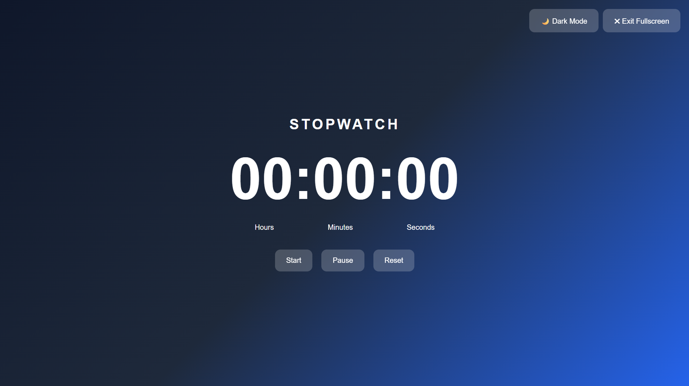
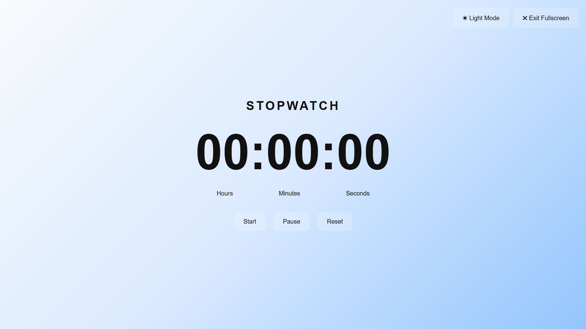

# ⏱️ M-Stopwatch

A modern fullscreen stopwatch built with HTML, CSS, and JavaScript.

## 🌐 Live Demo

https://manobala-t-n.github.io/M-stopwatch/

## ✨ Features

* Fullscreen Mode
* Dark Mode / Light Mode
* Modern Gradient UI
* Glassmorphism Controls
* Responsive Design
* Hours, Minutes & Seconds Display
* Start, Pause & Reset Controls
* Keyboard Shortcut Ready
* Mobile Friendly

---

## 📸 Screenshots

### Dark Mode

<p align="center">
  
</p>

### Light Mode

<p align="center">
  
</p>

---

## 🚀 Technologies Used

* HTML5
* CSS3
* JavaScript

---

## 📂 Project Structure

```text
M-stopwatch/
├── index.html
├── style.css
├── script.js
├── README.md
└── images/
    ├── dark-mode.png
    └── light-mode.png
```

---

## ▶️ Run Locally

```bash
git clone https://github.com/Manobala-T-N/M-stopwatch.git
cd M-stopwatch
```

Open `index.html` in your browser.

---

## 🎯 Future Improvements

* Lap Timer
* PWA Support
* Install as Mobile App
* Animated Background Effects
* Export Lap History
* Additional Themes

---

## 👨‍💻 Author

**Manobala T.N**

GitHub: https://github.com/Manobala-T-N

---

⭐ If you like this project, consider giving it a star.
